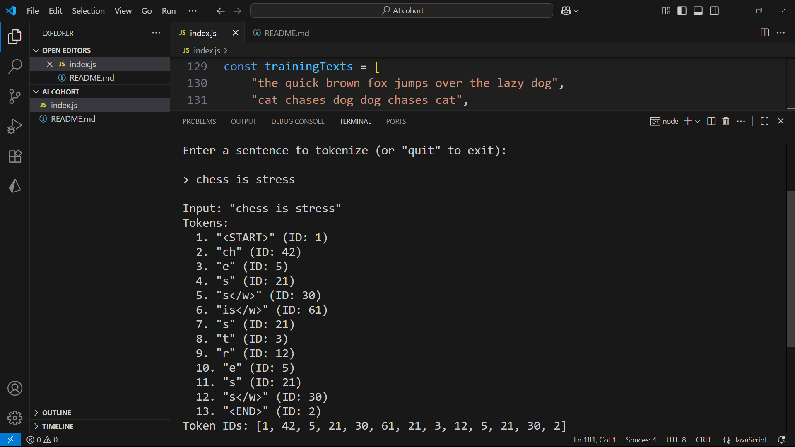

# Tokenizer

This project implements a simple CLI where users can input sentences and see how they get tokenized.

<b> Special Tokens</b>: Handles `<UNK>` `<START>` and `<END>` tokens
 <b>Vocabulary Learning:</b> Automatically builds vocabulary from training data <b>
Token Details:</b> Shows both token strings and their corresponding IDs

## Installation

<b> Clone this repository </b>

- `git clone https://github.com/GirdharGopalGG/tokenizer.git`

- `cd tokenizer`

## Usage

<b> Run the tokenizer: </b> `node index.js`

The program will:
- Train the tokenizer on built-in training data
- Launch an interactive CLI
- Wait for your input to tokenize sentences

CLI Commands:
- Enter any sentence to see its tokenization
- Type quit to exit the program

## Example

